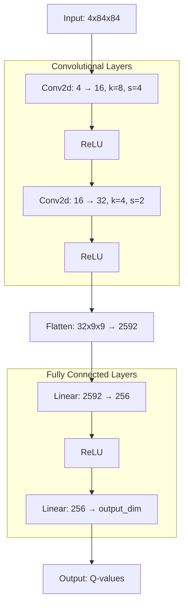

# torch-atari

Playing Atari Breakout with a DQN Agent, using PyTorch. This implementation is
based on [DeepMind 2013 paper]("https://arxiv.org/pdf/1312.5602") on Deep 
Reinforcement Learning to play Atari games.

## Overview
### Model architecture

The DQN network architecture consists of:
- 2 convolutional layers for feature extraction
- 2 fully connected layers for Q-value estimation

It can be found in the `src/dqn.py` file.



## Setup
Create a Virtual Environnement and install all dependencies to run the project 
without any problem :

```bash
python3 -m venv .venv
pip install -r requirements.txt
```

## Usage
Torch device will always be CUDA if it's possible, else it will be on CPU ...

### Training a New Agent

Train a new DQN agent :
```bash
python main.py "model_name.pth" --train
```
Every agent will be trained on 10M frames, where $\epsilon$ decreases over the 
first 1M frames to reach $0.1$. The model will also be updated every 4 frames 
(like said in the paper).

If you want to keep the same proportion but train on less frames, here is how 
you can do :
```bash
python main.py "model_name.pth" --train --frames nb_frames
```

### Loading and Testing a Trained Agent

Load a pre-trained model and watch it play:

```bash
python main.py "model_name.pth" --load
```

During the inference of our model in the game, we remove the frame skippin to
get better results.

### Available agents

You can load the agent you trained the command above, or you can also load 
pre-trained model. The pre-trained model are based on the architecture you have
seen previously.

#### Breakout
- `breakout_1m.pth`, model trained on Breakout during **1 000 000** frames
- `breakout_10m.pth`, model trained on Breakout during **10 000 000** frames
- `breakout_50m.pth`, model trained on Breakout during **50 000 000** frames

#### Pong
<!-- - `pong_1m.pth`, model trained on Pong during **1 000 000** frames -->
- `pong_10m.pth`, model trained on Pong during **10 000 000** frames

## Authors
Pierre SCHWEITZER (pierre.schweitzer)
